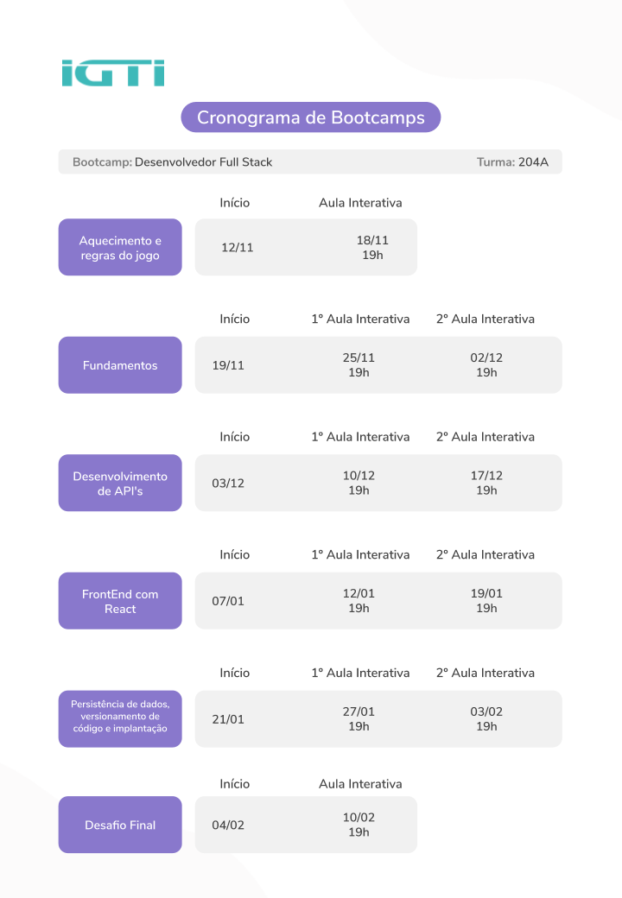

# Bootcamp-IGTI-Desenvolvedor-Full-Stack

<h4>Principais informações para o desenvolvimento dos trabalhos.</h4>

<ul>
  <li>Modulo 1 - Fundamentos</li>
    

  <li>Modulo 2 - Desenvolvimento de API's</li>

  <li>Modulo 3 - FrontEnd com React</li>
  
  <li>Modulo 4 - Persistência de dados, versionamento de código e implantação</li>
  
  <li>Modulo 5 - Desafio Final</li>
    <!-- <a href="https://drive.google.com/file/d/1hrvpqHWLKhnmAUd1H21TDh8nnnR6dt0K/view">Comandos Python - Aula 4.4. Coleta de dados no twitter: Exemplo utilizando a linguagem Python</a> -->
    
</ul>

